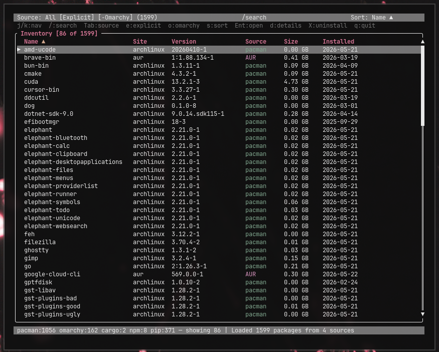

# inventory

A simple TUI to see every package installed on your machine — across pacman, AUR, cargo, npm globals, and pip — in one searchable, filterable list.

Built for [Omarchy](https://omarchy.org), but works on any Arch-based system.

You probably want to hit `e` to filter to explicitly-installed packages, then `o` twice until you see `[−Omarchy]` — that leaves you with just the things *you* installed.

`Enter` opens the package's web page (AUR / archlinux.org / crates.io / npmjs / pypi). `Shift+X` uninstalls. `d` opens a details panel.

## Keyboard shortcuts

### Navigation
| Key | Action |
|---|---|
| `j` / `↓` | Down one row |
| `k` / `↑` | Up one row |
| `J` / `K` | Jump 5 rows |
| `Ctrl-d` / `Ctrl-u` | Half-page down / up |
| `PageDown` / `PageUp` | Full page down / up |
| `g` / `Home` | Jump to top |
| `G` / `End` | Jump to bottom |

### Filtering & sorting
| Key | Action |
|---|---|
| `/` | Live search — filters as you type. `↑/↓/PgUp/PgDn` exit search and move the selection; `Enter`/`Esc` just exit search. |
| `Esc` | (in normal mode) Clear search query |
| `Tab` | Cycle source: All → pacman → omarchy → cargo → npm → pip → All |
| `e` | Toggle explicit-only (pacman install reason) |
| `o` | Cycle Omarchy filter: off → only → exclude |
| `s` | Cycle sort: Name↑ → Name↓ → Source↑ → Source↓ → Size↑ → Size↓ → Installed↑ → Installed↓ |

### Actions
| Key | Action |
|---|---|
| `Enter` | Open the selected package's web page |
| `d` | Show details (description, license, size, dependencies, required-by, …) |
| `Shift+X` | Uninstall the selected package (with confirmation) |
| `Shift+R` | Reload all sources |
| `q` | Quit |

## Inspired by

[esr/inventory](https://gitlab.com/esr/inventory)

